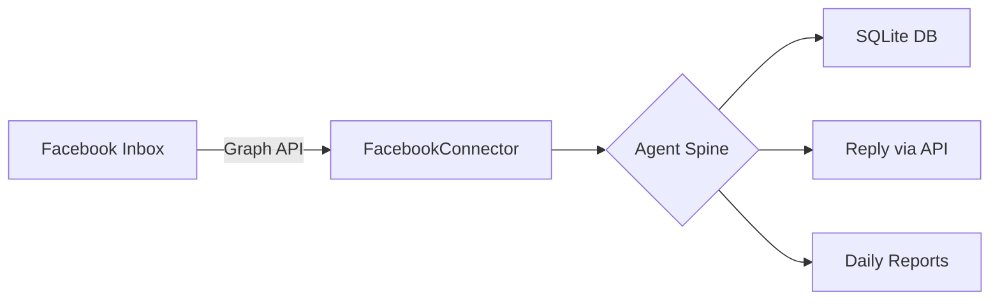

# Community Manager Agent Spine

> **An event-driven, engineering-first approach to automated community management.**

This project implements the **Spine** (Backbone) for a Community Manager Agent. It connects to **Facebook Business Inbox** via Graph API and persists data to **SQLite**.

## 🏗 Architecture



## 🚀 Quick Start

### Prerequisites
- Node.js v18+
- Facebook Page with Messaging enabled
- Page Access Token with `pages_messaging` permission

### Setup

1. **Clone and install**
```bash
git clone https://github.com/Charpup/community-manager-agent-spine.git
cd community-manager-agent-spine
npm install
```

2. **Configure environment**
```bash
cp .env.example .env
# Edit .env with your Facebook credentials
```

3. **Run in test mode (mocks)**
```bash
npm run test
```

4. **Run in production mode (real Facebook + SQLite)**
```bash
npm run dev
```

## ⚙️ Environment Variables

| Variable | Required | Default | Description |
|----------|----------|---------|-------------|
| `FB_PAGE_ID` | Yes | - | Your Facebook Page ID |
| `FB_PAGE_ACCESS_TOKEN` | Yes | - | Page Access Token |
| `POLL_INTERVAL_MS` | No | 15000 | Polling interval in ms |
| `SQLITE_PATH` | No | ./data/cm_agent.sqlite | SQLite database path |
| `NODE_ENV` | No | - | Set to `test` for mock mode |

## 📁 Project Structure

```
src/
├── agent.ts           # Core logic: Triage, Guardrails, Reply
├── config.ts          # Environment config loader
├── scheduler.ts       # Rescan scheduler
├── mocks.ts           # In-memory mocks for testing
├── connectors/
│   └── facebook.ts    # Facebook Graph API connector
├── repo/
│   ├── migrations.sql # SQLite schema
│   └── sqlite.ts      # SQLite repository
└── runtime/
    └── poller.ts      # Poll loop
```

## ✅ Features

- [x] **Triage**: Auto-categorize messages (payment, bug, refund, etc.)
- [x] **Guardrails**: Safety checks before auto-reply
- [x] **De-duplication**: Same message won't be processed twice
- [x] **Audit Trail**: All actions logged to database
- [x] **Daily Reports**: Auto-generated summaries

## 📝 Roadmap

- [x] Spine V1: Core Event Loop & Logic
- [x] Spine V2: Payment regex fix, Scheduler, Audit logging
- [x] Spine V3: Facebook Graph API + SQLite persistence
- [ ] LLM-based Intent Classification
- [ ] Multi-platform support (Discord, Email)
