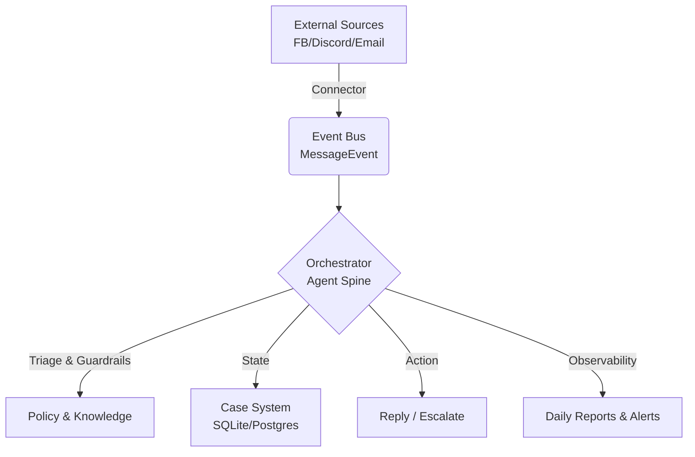

# Community Manager Agent Spine

> **An event-driven, engineering-first approach to automated community management.**

This project implements the **Spine** (Backbone) for a Community Manager Agent. Unlike simple chatbots, this system treats community interactions as a structured engineering pipeline: **Cruise -> Triage -> Execute -> Trace -> Report**.

It is designed to be **Pluggable**, **Auditable**, and **Safe**.

## 🏗 Architecture

The system follows a modular "Spine" architecture where the core logic is decoupled from specific platforms (like Facebook) or databases.



### Core Components

1.  **Connector Layer**: Adapters that normalize inputs from various sources (FB Business, Slack, etc.) into standard `MessageEvents`.
2.  **Agent Spine**: The central loop that processes messages.
    *   **Triage**: Rule-based categorization (Payment, Bug, Abuse) with strict severity gates.
    *   **Guardrails**: Safety checks preventing hallucinations, promise-making, or sensitive data requests.
    *   **Composition**: Template-first reply generation reinforced by RAG (Retrieval Augmented Generation).
3.  **Case System**: Tracks every thread as a "Case" with a lifecycle (`NEW` -> `WAITING` -> `RESOLVED` -> `ESCALATED`).
4.  **Observability**: Automated daily reports and real-time alerts for critical issues.

## 🚀 Design Intent

*   **Engineering over Chat**: We prioritize structure over "human-like" conversation. Every action is tracked in a Case.
*   **Safety First**: The agent defaults to escalation. It never guesses.
*   **Extensible**: Currently implemented with **Mocks** for immediate verification. Real implementation involves swapping `src/mocks.ts` with real API adapters.

## 🛠 Project Structure

*   `src/agent.ts`: **The Core**. Contains the main event loop, triage logic, and guardrails.
*   `src/types.ts`: Domain definitions (`CaseRecord`, `MessageEvent`, `TriageDecision`).
*   `src/mocks.ts`: **Adapters**. Currently contains In-Memory implementations for the DB and Inbox.
*   `src/main.ts`: **Runner**. A simulation script to verify the logic flow locally.

## 📦 Usage

### Prerequisites
*   Node.js v18+
*   npm

### Setup
```bash
npm install
```

### Run Verification
Run the simulation script to see the agent handle payment issues, collect details, and escalate critical requests.
```bash
npx ts-node src/main.ts
```

## 📝 Roadmap
- [x] **Spine V1**: Core Event Loop & Logic
- [ ] **Connector**: Facebook Graph API Integration
- [ ] **Storage**: SQLite / Postgres Adapter
- [ ] **Intelligence**: LLM-based Intent Classification (Replacing regex heuristics)
