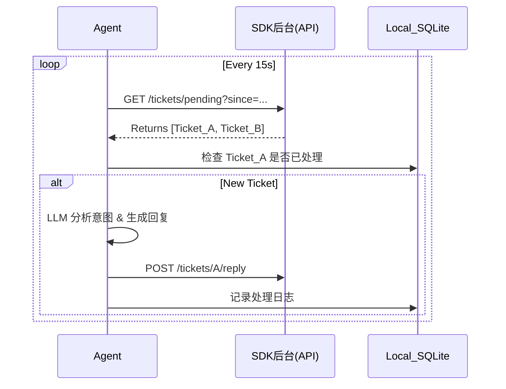

# SDK 后台社区经理 - 集成方案建议书

## 1. 核心目标
将现有的社区经理 Agent 核心逻辑（意图识别、自动回复、情感分析）复用到自建 SDK 后台的客诉系统中。
- **当前状态**：Agent 是为 Facebook 设计的。
- **目标状态**：Agent 同时支持（或切换为）对接 SDK 后台 API。

## 2. 架构设计：Connector 模式
目前的 Agent 采用 `InboxConnector` 接口模式，这使得迁移非常容易。不仅不需要重写核心逻辑，甚至可以支持"双卡双待"（同时监听 FB 和 SDK 后台）。

### 2.1 新增模块：`SDKBackendConnector`
我们需要实现一个新的 Connector 类，适配 `InboxConnector` 接口：

```typescript
class SDKBackendConnector implements InboxConnector {
    channel = 'sdk_backend';
    
    // 轮询 SDK 后台，获取未处理的工单
    async fetchNewMessages(sinceMs: number): Promise<MessageEvent[]> { ... }
    
    // 调用 SDK 后台接口进行回复
    async sendReply(threadId: string, text: string): Promise<void> { ... }
}
```

## 3. SDK 后台接口需求 (API Requirements)
为了实现上述功能，我们需要 SDK 后台提供（或适配）以下 2 个核心接口。建议采用 RESTful 风格。

### 3.1 获取待处理工单 (Get Pending Tickets)
- **用途**：Polling 轮询，每隔 X 秒拉取一次。
- **建议 HTTP Method**: `GET`
- **建议 Path**: `/api/v1/agent/tickets/pending`
- **Query 参数**:
    - `since_time`: (Optional) ISO 字串或时间戳，拉取该时间之后更新的工单。
    - `limit`: (Optional) 限制返回数量。
- **Response 结构**:
    ```json
    {
      "data": [
        {
          "ticket_id": "10086",
          "user_id": "u_9527",
          "title": "充值未到账",
          "content": "我刚才充了648，但是钻石没变，快处理！",
          "created_at": "2026-01-22T12:00:00Z",
          "status": "open",
          "history": [ // (可选) 上下文历史，用于 LLM 理解前因后果
             {"role": "user", "content": "在吗？"},
             {"role": "admin", "content": "您好，请问有什么可以帮您？"}
          ]
        }
      ]
    }
    ```

### 3.2 提交回复 (Reply to Ticket)
- **用途**：Agent 生成回复内容后，回调此接口发送给用户。
- **建议 HTTP Method**: `POST`
- **建议 Path**: `/api/v1/agent/tickets/{ticket_id}/reply`
- **Request Body**:
    ```json
    {
      "ticket_id": "10086",
      "reply_content": "您好，收到您的反馈。请提供一下您的角色ID和区服，我们立即为您核查订单状态。",
      "action": "reply", // 或 "resolve" 如果觉得问题已解决
      "agent_id": "ai_agent_01" // 标识是 AI 回复的
    }
    ```

## 4. 数据流转图


## 5. 开发路线图 (Roadmap)
1.  **Mock 阶段**：不依赖真实 SDK 后台，我先写一个 `MockSDKServer` (模拟器)，跑通上述流程。
2.  **接口对接**：你提供真实的 SDK 后台 API 文档或测试环境。
3.  **双向联调**：将 Agent 接入 SDK 测试服。
